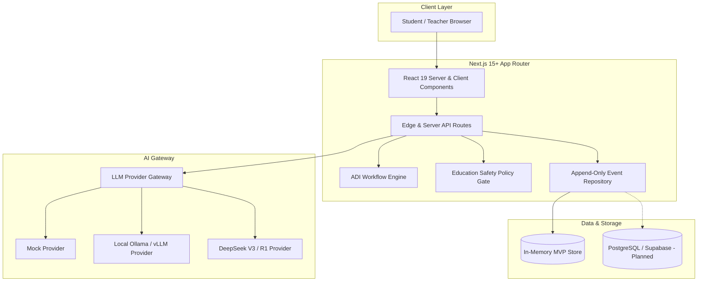

# Learning OS — Administrator & Deployment Guide
**Enterprise Infrastructure, Customization, & Operations Manual**

---

## 1. System Architecture & Overview

Learning OS is engineered with a modular, enterprise-grade architecture utilizing modern web standards and strict security boundaries.



### Core Architectural Principles:
1. **Server-Side AI Isolation**: All LLM API keys and model calls reside strictly on the server. No credentials or prompt instructions are ever leaked to client browsers.
2. **Deterministic Safety Guardrails**: Every AI response is evaluated through the `EducationSafetyPolicy` before being returned to students.
3. **Immutable Event Ledger**: Pedagogical interactions generate structured, append-only `LearningEvent` records.
4. **Zero Vendor Lock-In**: Pluggable provider abstraction allows seamless switching between Mock, Local on-premise models, and Cloud LLMs.

---

## 2. System Requirements & Prerequisites

### Server Environment Requirements:
- **Node.js**: `v20.x` or `v22.x` LTS (minimum `v18.17.0+`)
- **Package Manager**: `npm` (v10+), `pnpm` (v9+), or `yarn` (v1.22+)
- **Operating System**: Linux (Ubuntu 22.04+, Debian 12, RHEL 9), macOS (13+), or Windows Server 2022+ / Windows 11
- **Hardware Sizing**:
  - *Standard Web Server*: 2 vCPU, 2 GB RAM, 10 GB SSD.
  - *With On-Premises Local LLM (Ollama/vLLM)*: 8+ vCPU, 16–32 GB RAM, optional NVIDIA GPU (e.g., RTX 4090, A10G, or T4).

---

## 3. Environment Variables & Configuration

Create or modify your `.env.local` (for development) or system environment variables (for production).

```bash
# ==============================================================================
# LEARNING OS CONFIGURATION TEMPLATE
# ==============================================================================

# Application Branding
NEXT_PUBLIC_APP_NAME="Learning OS"

# AI Provider Strategy: "mock" | "local" | "deepseek"
LEARNING_LLM_PROVIDER="mock"

# Configuration for Local LLM (e.g., Ollama, vLLM, LM Studio)
LOCAL_LLM_BASE_URL="http://localhost:11434/v1"
LOCAL_LLM_MODEL="qwen2.5:7b-instruct"

# Configuration for DeepSeek API
DEEPSEEK_API_KEY="sk-your-deepseek-api-key-here"
DEEPSEEK_BASE_URL="https://api.deepseek.com"
DEEPSEEK_MODEL="deepseek-chat"

# Runtime Environment
NODE_ENV="production"
PORT=3000
```

### Provider Configuration Matrix

| `LEARNING_LLM_PROVIDER` | Description | Recommended Use Case | Required Variables |
| :--- | :--- | :--- | :--- |
| `mock` | Deterministic local simulator; zero external network requests. | Development, CI/CD, and offline testing. | None |
| `local` | Connects to an OpenAI-compatible local model server. | High data privacy, offline school lab, air-gapped deployments. | `LOCAL_LLM_BASE_URL`, `LOCAL_LLM_MODEL` |
| `deepseek` | Cloud-hosted DeepSeek V3 / R1 reasoning model. | Production deployments with full high-accuracy Socratic inquiry. | `DEEPSEEK_API_KEY`, `DEEPSEEK_BASE_URL`, `DEEPSEEK_MODEL` |

> [!NOTE]
> DeepSeek mode is an explicit opt-in. Supplying an API key will **not** activate cloud calls unless `LEARNING_LLM_PROVIDER="deepseek"` is explicitly set.

---

## 4. Deployment Strategies

### 4.1 Deployment to Vercel (Recommended Cloud Option)

1. **Import Repository**:
   Connect your GitHub/GitLab repository to Vercel.
2. **Configure Build Settings**:
   - **Framework Preset**: Next.js
   - **Build Command**: `npm run build`
   - **Output Directory**: `.next`
   - **Install Command**: `npm install`
3. **Set Environment Variables**:
   In the Vercel Project Settings under **Environment Variables**, add:
   - `LEARNING_LLM_PROVIDER`: `deepseek` (or `mock`)
   - `DEEPSEEK_API_KEY`: `sk-...`
   - `DEEPSEEK_BASE_URL`: `https://api.deepseek.com`
   - `DEEPSEEK_MODEL`: `deepseek-chat`
4. **Deploy**:
   Click **Deploy**. Vercel will automatically provision edge caching and serverless API functions.

---

### 4.2 Docker Containerization

Use the following multi-stage `Dockerfile` to create an optimized, secure production image:

```dockerfile
# ------------------------------------------------------------------------------
# Stage 1: Dependencies
# ------------------------------------------------------------------------------
FROM node:20-alpine AS deps
RUN apk add --no-cache libc6-compat
WORKDIR /app
COPY package*.json ./
RUN npm ci

# ------------------------------------------------------------------------------
# Stage 2: Builder
# ------------------------------------------------------------------------------
FROM node:20-alpine AS builder
WORKDIR /app
COPY --from=deps /app/node_modules ./node_modules
COPY . .
ENV NEXT_TELEMETRY_DISABLED=1
ENV NODE_ENV=production
RUN npm run build

# ------------------------------------------------------------------------------
# Stage 3: Runner
# ------------------------------------------------------------------------------
FROM node:20-alpine AS runner
WORKDIR /app
ENV NODE_ENV=production
ENV PORT=3000
ENV HOSTNAME="0.0.0.0"
ENV NEXT_TELEMETRY_DISABLED=1

RUN addgroup --system --gid 1001 nodejs && \
    adduser --system --uid 1001 nextjs

COPY --from=builder /app/public ./public
COPY --from=builder --chown=nextjs:nodejs /app/.next ./.next
COPY --from=builder /app/node_modules ./node_modules
COPY --from=builder /app/package.json ./package.json

USER nextjs
EXPOSE 3000

CMD ["npm", "run", "start"]
```

#### Running with Docker Compose (`docker-compose.yml`):

```yaml
version: '3.8'

services:
  learning-os:
    build: .
    container_name: learning-os-app
    restart: unless-stopped
    ports:
      - "3000:3000"
    environment:
      - NODE_ENV=production
      - LEARNING_LLM_PROVIDER=deepseek
      - DEEPSEEK_API_KEY=${DEEPSEEK_API_KEY}
      - DEEPSEEK_BASE_URL=https://api.deepseek.com
      - DEEPSEEK_MODEL=deepseek-chat
      - NEXT_PUBLIC_APP_NAME="Learning OS"
    healthcheck:
      test: ["CMD", "wget", "-qO-", "http://localhost:3000/api/health"]
      interval: 30s
      timeout: 5s
      retries: 3
```

---

### 4.3 Bare-Metal / Linux VM Deployment with PM2 & Nginx

#### Step 1: Build Application
```bash
# Clone repository
git clone <repo-url> /opt/learning-os
cd /opt/learning-os

# Install & Build
npm ci
npm run build
```

#### Step 2: Configure PM2 Process Manager
Create `/opt/learning-os/ecosystem.config.js`:
```javascript
module.exports = {
  apps: [
    {
      name: 'learning-os',
      script: 'node_modules/next/dist/bin/next',
      args: 'start',
      instances: 'max',
      exec_mode: 'cluster',
      env: {
        NODE_ENV: 'production',
        PORT: 3000,
        LEARNING_LLM_PROVIDER: 'deepseek',
        DEEPSEEK_API_KEY: 'sk-...',
      },
    },
  ],
};
```
Start PM2:
```bash
pm2 start ecosystem.config.js
pm2 save
pm2 startup
```

#### Step 3: Configure Nginx Reverse Proxy
Create `/etc/nginx/sites-available/learning-os`:
```nginx
server {
    listen 80;
    server_name learning-os.school.edu;

    location / {
        proxy_pass http://127.0.0.1:3000;
        proxy_http_version 1.1;
        proxy_set_header Upgrade $http_upgrade;
        proxy_set_header Connection 'upgrade';
        proxy_set_header Host $host;
        proxy_cache_bypass $http_upgrade;
        proxy_set_header X-Real-IP $remote_addr;
        proxy_set_header X-Forwarded-For $proxy_add_x_forwarded_for;
        proxy_set_header X-Forwarded-Proto $scheme;
    }
}
```

---

## 5. Curriculum & Data Customization

All curriculum content, CER investigation prompts, approved contexts, and rubrics are modular and stored in typed TypeScript schemas under `src/data/`.

### 5.1 Adding or Modifying Activities
To add a new activity or unit, open [`src/data/course/ecosystem/activities.ts`](file:///c:/Users/woram/OneDrive/Desktop/Hatairat/learn%20os/src/data/course/ecosystem/activities.ts):

```typescript
import type { Activity } from "@/lib/domain/types";

export const ecosystemActivities: Activity[] = [
  {
    id: "ecosystem-food-web-01",
    courseId: "biology-m4",
    unit: "ระบบนิเวศ",
    title: "วิเคราะห์การเปลี่ยนแปลงในสายใยอาหาร",
    adiPhase: "argument",
    prompt: "หากจำนวนงูลดลงอย่างมากในระบบนิเวศนี้ จงอธิบายผลกระทบที่น่าจะเกิดขึ้นต่อประชากรหนู พืช และพลังงานในระบบ โดยเขียนเป็น Claim–Evidence–Reasoning",
    context: "ระบบตัวอย่างประกอบด้วย หญ้า → ตั๊กแตน → กบ → งู และ หญ้า → หนู → งู โดยพลังงานถ่ายทอดจากผู้ผลิตไปยังผู้บริโภคและลดลงในแต่ละลำดับขั้น",
    rubricDimensions: ["claim", "evidence", "reasoning"],
    peerReviewAllowed: false,
  },
  // ADD YOUR NEW ACTIVITY HERE:
  {
    id: "ecosystem-carbon-cycle-01",
    courseId: "biology-m4",
    unit: "วัฏจักรสารในระบบนิเวศ",
    title: "วิเคราะห์ผลกระทบของการตัดไม้ทำลายป่าต่อวัฏจักรคาร์บอน",
    adiPhase: "investigation",
    prompt: "การลดลงของพื้นที่ป่าไม้อย่างรวดเร็วจะส่งผลต่อปริมาณคาร์บอนไดออกไซด์ในบรรยากาศและอุณหภูมิเฉลี่ยของโลกอย่างไร?",
    context: "พืชตรึงคาร์บอนผ่านการสังเคราะห์ด้วยแสง เมื่อพืชถูกทำลาย คาร์บอนที่สะสมจะถูกปล่อยคืนสู่บรรยากาศผ่านการเผาหรือย่อยสลาย ส่งผลให้ก๊าซเรือนกระจกเพิ่มขึ้น",
    rubricDimensions: ["claim", "evidence", "reasoning"],
    peerReviewAllowed: true,
  },
];
```

### 5.2 Registering Approved Knowledge Context
The AI Coach is strictly bound to approved instructional context. Ensure matching knowledge entries exist in [`src/lib/knowledge/approved-context.ts`](file:///c:/Users/woram/OneDrive/Desktop/Hatairat/learn%20os/src/lib/knowledge/approved-context.ts) to guarantee zero halluncinations.

---

## 6. Branding & UI Theme Customization

To tailor the user interface to your school or institutional design tokens, edit [`src/app/globals.css`](file:///c:/Users/woram/OneDrive/Desktop/Hatairat/learn%20os/src/app/globals.css):

```css
:root {
  /* Core Brand Colors */
  --ink: #17252f;           /* Primary text color */
  --muted: #66757d;         /* Secondary/caption text */
  --line: #dbe4e3;          /* Border and divider lines */
  --paper: #f5f7f3;         /* Workspace background */
  --card: #ffffff;          /* Card container background */
  --teal: #106b68;          /* Primary institutional accent */
  --teal-dark: #084b4c;     /* Button hover state */
  --coral: #e4775a;         /* Alert and timeline accent */
  --yellow: #f2c66d;        /* Status and notice badge */
}
```

### Modifying Application Title & Headers:
1. Update `NEXT_PUBLIC_APP_NAME="Your School Name — Learning OS"` in your `.env.local`.
2. Update metadata in [`src/app/layout.tsx`](file:///c:/Users/woram/OneDrive/Desktop/Hatairat/learn%20os/src/app/layout.tsx).

---

## 7. Security, Privacy & Data Compliance

### 7.1 Student Scope Isolation
The system enforces strict multi-tenant boundary checks:
```typescript
// Verified at src/lib/context/learning-context.ts
export function assertStudentScope(context: LearningContext, requestedStudentId: string): void {
  if (context.role !== "student" || context.studentId !== requestedStudentId) {
    throw new Error("Learning scope denied: student data is restricted to the authenticated student");
  }
}
```

### 7.2 Research Data Anonymization
Learning OS includes a built-in research export pipeline (`GET /api/research/export`) that strictly separates student real-world identity from longitudinal process telemetry:
- **Participant Identity Table**: `participantKey` $\leftrightarrow$ `studentId` (retained offline by the principal investigator).
- **Process Evidence Rows**: Timestamps, events, hint depths, and CER metrics (fully de-identified for analysis in SPSS, R, or Python).

---

## 8. Health Monitoring & Maintenance

### 8.1 System Health Endpoint
Monitor uptime and configuration status via `GET /api/health`:

**Request:**
```bash
curl http://localhost:3000/api/health
```

**Response:**
```json
{
  "status": "ok",
  "app": "Learning OS",
  "llmProvider": "deepseek",
  "persistence": "in-memory-mvp"
}
```

### 8.2 Production Verification Checklist
Execute standard verification tests before rolling out updates:
```bash
# 1. Typecheck TypeScript contracts
npm run typecheck

# 2. Run automated test suite
npm test

# 3. Compile production build
npm run build
```
