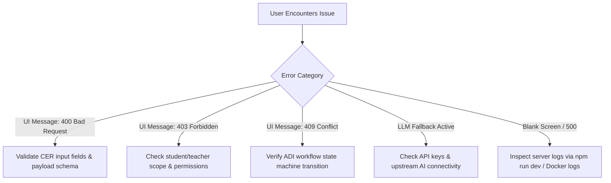

# Learning OS — Customer FAQ & Troubleshooting Guide
**Comprehensive Frequently Asked Questions, Diagnostic Playbooks, & Support Protocols**

---

## 1. General Product & Pedagogical FAQs

### Q1: What makes Learning OS different from standard AI chatbots like ChatGPT or Claude?
**A:** Traditional chatbots are *generative and substitutive*—they frequently write essays, synthesize answers, or solve homework problems on behalf of students, short-circuiting genuine cognitive struggle. 

**Learning OS is non-substitutive and Socratic**:
- It is architecturally prohibited from generating direct answers or drafting paragraphs for students.
- It analyzes student input across Claim–Evidence–Reasoning (CER) dimensions and returns targeted inquiry questions grounded strictly in teacher-approved curriculum.
- It captures authentic learning processes, revisions, and cognitive milestones on an immutable timeline.

---

### Q2: Will using AI hints penalize or lower a student's grade?
**A:** **No.** In Learning OS, hint costs (ranging from `0` to `-3`) are tracked strictly as **process metrics** (`ai_independence_score`) to measure metacognitive autonomy. 
- Academic grading remains 100% under the educator's discretion via the Teacher Dashboard.
- Instructors are encouraged to view hint usage as a positive sign of student engagement and self-directed help-seeking behavior.

---

### Q3: What happens if our school's internet goes down or the external AI provider is unavailable?
**A:** Learning OS is built with **multi-tiered fault tolerance**:
1. If the primary cloud AI provider encounters a timeout, network disruption, or quota limit, the system instantly switches to a **deterministic educational fallback engine**.
2. Students receive curated, curriculum-aligned Socratic questions without disruption.
3. A transparent badge indicates that fallback mode was utilized, and learning continues seamlessly.

---

### Q4: Does Learning OS perform automated plagiarism detection?
**A:** **No.** Commercial "AI detectors" suffer from high false-positive rates and lack pedagogical context. Instead, Learning OS provides **Authorship Indicators**:
- It tracks objective signals (e.g., elapsed drafting time, prompt word overlap, revision iterations).
- It highlights submissions for *teacher observation* (`none`, `observe`, `teacher_review`).
- The system never issues accusations or automatic penalties; it simply equips teachers with contextual evidence for personalized 1-on-1 conversations.

---

## 2. Student & Learner FAQs

### Q5: How do I know which hint depth to select?
**A:** Choose your hint level based on where you feel stuck:
- **ไม่ขอความช่วยเหลือ (None - 0)**: Select this when you feel confident and want to test your independent understanding.
- **ถามตื้น (Shallow - 1)**: Select this if you have written your ideas but want to check if any core CER structure is missing.
- **ถามกลาง (Concept - 2)**: Select this if you are unsure about the specific ecological or biological relationships involved.
- **Socratic Deep Dive (Deep - 3)**: Select this if you need comprehensive, step-by-step Socratic guidance to unravel a complex problem.

---

### Q6: How do I improve my Claim–Evidence–Reasoning (CER) score?
**A:** Follow these guidelines:
1. **Claim**: Keep it direct and specific. State what will happen (e.g., *"Grass biomass will increase"*).
2. **Evidence**: Cite concrete facts from the lesson context or data table. Avoid general opinions (e.g., *"Data shows that grasshoppers consume grass as primary producers"*).
3. **Reasoning**: Explain the biological mechanism connecting evidence to your claim using concepts like trophic levels, energy loss, or predator-prey dynamics.

---

### Q7: Where can I see my previous versions and teacher comments?
**A:** 
- **During an Activity**: Scroll down to the **Revision History** card at the bottom of the workbench.
- **Across All Sessions**: Click on **My learning timeline** in the header or navigate directly to `/student/timeline`.

---

## 3. Educator & Administrator FAQs

### Q8: How do I review and grade student submissions?
**A:**
1. Navigate to `/teacher/review`.
2. Review class-level metrics in the top overview cards.
3. Locate the student submission card to inspect the full CER draft, revision versions, and AI interaction history.
4. Enter your score (0–100) and qualitative feedback in the **Teacher Final Review** box.
5. Click **Assign final score**. The submission status will immediately update to `completed`.

---

### Q9: How can I export data for academic research or institutional reports?
**A:**
- Navigate to `/teacher/analytics` and click **Export separated evidence →** (or access `GET /api/research/export`).
- The system generates a clean JSON dataset isolating student participant keys from longitudinal event records, fully compatible with Python, R, SPSS, and Excel.

---

### Q10: How do I enable or disable peer review for an activity?
**A:**
In [`src/data/course/ecosystem/activities.ts`](file:///c:/Users/woram/OneDrive/Desktop/Hatairat/learn%20os/src/data/course/ecosystem/activities.ts), locate the activity configuration and toggle `peerReviewAllowed: true` or `false`.

---

## 4. Technical Troubleshooting & Diagnostic Playbook

### Diagnostic Resolution Matrix



---

### Detailed Error Code Resolutions

#### 1. `400 Bad Request` — "ข้อมูล submission ไม่ถูกต้อง"
- **Cause**: One or more required fields (e.g., empty studentId, missing CER object, or invalid response time) failed Zod schema validation.
- **Resolution**: Ensure all three CER textareas contain text before submission. Verify that numeric fields are not negative.

---

#### 2. `403 Forbidden` — "ไม่อนุญาตให้เข้าถึงข้อมูลของนักเรียนคนอื่น"
- **Cause**: Student scope boundary violation. A student session attempted to access or modify records belonging to a different student ID.
- **Resolution**: In development, ensure queries match `demo-student-01`. In production, verify that authentication session tokens match the active URL parameters.

---

#### 3. `409 Conflict` — "ADI workflow ไม่อนุญาตให้รับ feedback ในสถานะนี้"
- **Cause**: Out-of-order state machine transition (e.g., attempting to receive feedback on an already finalized/completed submission).
- **Resolution**: Refresh the workbench to synchronize the latest submission state, or start a new activity draft iteration.

---

#### 4. "LLM ไม่พร้อมใช้งาน: แสดงคำถาม Socratic แบบ manual fallback แล้ว"
- **Cause**: Upstream AI provider (DeepSeek / Local LLM) timed out, returned an invalid JSON response, or was unreachable due to network restrictions.
- **Resolution**:
  1. Check `.env.local` to verify `DEEPSEEK_API_KEY` is active and has sufficient quota.
  2. If using Local LLM, verify Ollama/vLLM is running: `curl http://localhost:11434/v1/models`.
  3. If running offline, set `LEARNING_LLM_PROVIDER="mock"` in `.env.local` to use the high-speed local simulator.

---

## 5. Browser & Device Compatibility

Learning OS is fully responsive and optimized for modern web browsers:

| Platform / Browser | Version Supported | Status | Notes |
| :--- | :---: | :---: | :--- |
| **Google Chrome** | 110+ (Desktop & Mobile) | Verified Optimal | Full support for all modern CSS & responsive layouts. |
| **Microsoft Edge** | 110+ (Desktop) | Verified Optimal | Standard recommended browser for Windows school labs. |
| **Apple Safari** | 16.4+ (macOS & iPadOS) | Verified Optimal | Native support on school iPads and MacBooks. |
| **Mozilla Firefox** | 115+ (ESR & Standard) | Verified Optimal | Full standard compliance. |
| **Mobile / Tablets** | iOS 16+, Android 12+ | Verified Optimal | Single-column responsive layout activates automatically under 800px width. |

---

## 6. Support Channels & Escalation Paths

```text
Tier 1: School IT / Classroom Teacher
└── Handles: Student logins, browser cache issues, classroom network/Wi-Fi.

Tier 2: School Academic & Curriculum Coordinator
└── Handles: Activity customization, rubric tuning, teacher review workflows.

Tier 3: Platform Engineering & Technical Support
└── Handles: Server deployments, API provider integrations, database persistence, bug reports.
```

### Submitting a Diagnostic Report:
When contacting technical support, please provide:
1. **Health Check Output**: `GET /api/health` response.
2. **Current Workflow State**: Submission version and activity ID.
3. **Browser Console Log**: Any client-side error traces from Developer Tools (`F12` $\rightarrow$ Console).
4. **Server Log Snippet**: Relevant lines from `npm run dev` or container logs.
