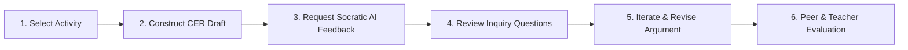
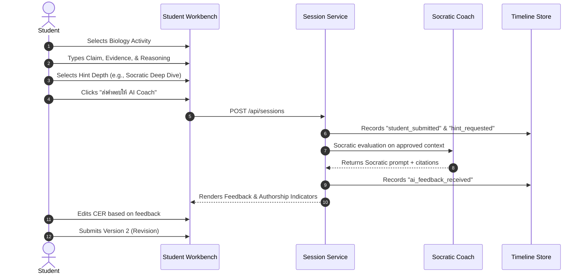
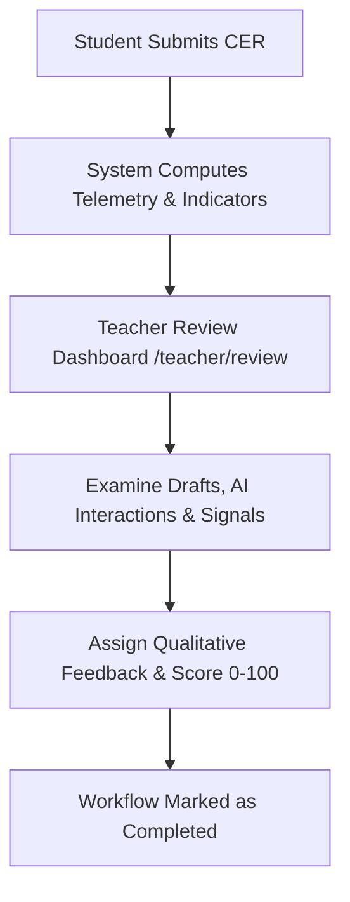

# Learning OS — Customer User Manual
**Next-Generation Argument-Driven Inquiry (ADI) & Socratic AI Learning Platform**

---

## Executive Summary & Welcome

Welcome to **Learning OS**, an intelligent learning ecosystem designed to cultivate scientific thinking, analytical reasoning, and disciplined inquiry. Built on the proven **Argument-Driven Inquiry (ADI)** methodology and the **Claim–Evidence–Reasoning (CER)** framework, Learning OS provides learners with a structured scientific workbench supported by a non-substitutive **Socratic AI Coach**.

Unlike conventional generative AI tools that simply provide answers, Learning OS acts as an intellectual sparring partner:
- **Promotes Active Cognition**: The AI asks probing Socratic questions, challenging learners to substantiate assertions and discover logical links independently.
- **Transparent Process Evidence**: Every draft, hint request, AI interaction, and revision is preserved on an immutable timeline.
- **Teacher-Centered Authority**: Final evaluation, scoring, and qualitative guidance remain exclusively under educator control.



---

## 1. Core Educational Frameworks

### 1.1 The Argument-Driven Inquiry (ADI) Model
Learning OS structures scientific investigations across defined ADI stages:
1. **Orientation & Identification**: Exploring phenomena and formulating testable questions.
2. **Investigation & Data Collection**: Analyzing ecological relationships, food webs, and energy transfers.
3. **Argumentation (CER Workbench)**: Formulating scientific claims with empirical backing.
4. **Interactive Scaffolding**: Engaging with the Socratic AI Coach at selected hint depths.
5. **Peer Review & Collaboration**: Structured peer evaluation (when enabled for the unit).
6. **Iterative Revision**: Refining arguments based on feedback and newly integrated evidence.
7. **Teacher Review & Reflection**: Final educator assessment and metacognitive reflection.

### 1.2 The Claim–Evidence–Reasoning (CER) Framework
Scientific arguments in Learning OS are constructed across three distinct dimensions:

| Dimension | Definition | Example in Ecosystem Biology |
| :--- | :--- | :--- |
| **Claim** | A direct statement answering the core investigation question. | *"A sharp decrease in the snake population will lead to an initial surge in rat populations and a subsequent decline in primary producer biomass."* |
| **Evidence** | Measurable observations, course data, or validated lesson materials. | *"In food chain data, snakes act as tertiary consumers feeding directly on rodents (herbivores/secondary consumers)."* |
| **Reasoning** | The scientific principle or mechanism connecting evidence to the claim. | *"By trophic cascade principles, apex/tertiary predator removal relieves predation pressure, enabling prey overconsumption of vegetation before reaching new carrying capacity."* |

---

## 2. Navigating the Platform

### 2.1 Portal Overview & Navigation Map

```text
Learning OS Navigation Architecture
├── Student Hub (/student)
│   ├── ADI Ecosystem Lab (/student/activity or /)
│   └── My Learning Timeline (/student/timeline)
└── Educator & Administrator Portal
    ├── Teacher Review Dashboard (/teacher/review)
    └── Class Evidence Analytics (/teacher/analytics)
```

---

## 3. Student & Learner Experience Walkthrough



### Step 1: Accessing the Student Hub (`/student`)
1. Navigate to your organization's Learning OS portal.
2. The **Student Hub** displays available learning pathways and quick actions:
   - **Start Activity**: Direct access to the active biology module (`/student/activity`).
   - **My Learning Timeline**: Direct access to your historical learning journey (`/student/timeline`).

---

### Step 2: Engaging with the ADI Workbench (`/student/activity` or `/`)

The Workbench is divided into intuitive, card-based workspaces:

#### Section 01: Activity & Context Card
- **Activity Selector**: Choose the assigned module (e.g., *"วิเคราะห์การเปลี่ยนแปลงในสายใยอาหาร"* or *"อธิบายการไหลของพลังงาน"*).
- **Inquiry Prompt**: Review the central biological scenario and investigation instructions.
- **Approved Context Box**: Access verified background facts, trophic levels, and ecological rules provided by your instructor.
- **Phase Status**: Inspect unit metadata and whether peer review is active.

#### Section 02: CER Argument Editor
Enter your thoughts in the dedicated multi-line fields:
- **Claim Box**: Write your primary hypothesis or conclusion.
- **Evidence Box**: Supply scientific observations from the activity context.
- **Reasoning Box**: Explain the biological mechanisms connecting your evidence to your claim.

#### Section 03: Hint Depth & Process Controls
Before submitting, tailor the cognitive support you require:

| Hint Depth Setting | Cognitive Level | Recorded Hint Cost | Learning Process Impact |
| :--- | :--- | :---: | :--- |
| **ไม่ขอความช่วยเหลือ (None)** | Independent inquiry | `0` | Demonstrates full learner autonomy |
| **ถามตื้น (Shallow)** | Clarification question | `-1` | Identifies missing structural elements |
| **ถามกลาง (Concept)** | Concept check | `-2` | Probes specific biological relationships |
| **Socratic Deep Dive (Deep)** | Multi-step inquiry | `-3` | Comprehensive Socratic dialogue |

> [!NOTE]
> **Process Metrics vs. Academic Grades**: Hint costs are recorded as cognitive process indicators (`ai_independence_score`). They reflect learning autonomy and are **never** automatically deducted from your academic score.

- **Response Time Input**: Tracks active deliberation time in seconds.
- **Submit Button ("ส่งคำตอบให้ AI Coach")**: Sends your draft for instant Socratic analysis.

---

### Step 3: Reviewing Socratic AI Feedback

Once submitted, the results panel displays dynamic insights:

#### Section 03: Coach Feedback Card
- **Targeted Dimension Badge**: Highlights the exact CER area requiring attention (`[claim]`, `[evidence]`, or `[reasoning]`).
- **Socratic Prompt Quote**: Provides guided inquiry (e.g., *"ลองอธิบายกลไกที่เชื่อมหลักฐานกับ claim ของคุณ: การลดลงของผู้ล่าส่งผลต่อการถ่ายทอดพลังงานในห่วงโซ่อาหารอย่างไร?"*).
- **Approved Citations**: Displays exact source citations from the curriculum.
- **Guardrail Confirmation**: Confirms that direct answers were blocked to protect authentic learning.
- **Provider Status**: Displays system operational mode (`Mock-safe`, `Local LLM`, or `DeepSeek Cloud`).

#### Section 04: Learning Evidence & Telemetry
Displays real-time metrics captured for your teacher:
- **Draft Version**: Current iteration number (v1, v2, etc.).
- **Hint Cost**: Cumulative scaffolding cost.
- **Response Time**: Total drafting duration.
- **Prompt Similarity**: Lexical alignment indicator.
- **Teacher Review Signal**: Indicator status (`none`, `observe`, or `teacher_review`).

---

### Step 4: Iterative Revision & History

1. Review the Coach's inquiry questions.
2. Return to the CER textareas to refine, expand, and strengthen your argument.
3. Submit again to create **Version 2**.
4. Review the **Revision History** and **My Timeline** cards at the bottom of the page to observe your intellectual progression across drafts.

---

### Step 5: Exploring Personal Learning Timeline (`/student/timeline`)

The **Learning Timeline** is your personal, private ledger of growth:
- **Chronological Event Stream**: Every submission, hint requested, phase change, and feedback receipt timestamped in local time.
- **Artifact History**: View each version of your submitted work with its associated workflow state (`submitted`, `ai_feedback_received`, `revising`, `teacher_review`, `completed`).
- **Data Isolation Guarantee**: You will only ever see your own learning events. Cross-student data leakage is strictly blocked by platform policy.

---

## 4. Educator & Instructor Guide

The Teacher Portal empowers educators with actionable evidence, eliminating guesswork while keeping grading decisions human-led.



### 4.1 Teacher Review Dashboard (`/teacher/review`)

#### 1. Metric Overview Bar
At the top of the dashboard, track real-time class engagement:
- **Submissions**: Total submissions received across all class activities.
- **Revisions**: Number of iterative revisions performed by learners.
- **Hints**: Total scaffolding requests initiated.
- **Fallbacks**: Any instances where offline/manual fallback was utilized.

#### 2. Comprehensive Submission Review Cards
Each student submission is rendered with complete contextual evidence:
- **Activity Title & Version Header**: Instant view of the module name, draft version, and workflow state.
- **3-Pillar CER Display**: Side-by-side presentation of the student's Claim, Evidence, and Reasoning.
- **Evidence Grid**:
  1. *Revision History*: Timestamps and version links for all previous iterations.
  2. *AI Interactions*: Complete log of Socratic prompts delivered, hint depths requested, and AI provider used.
  3. *Authorship Indicator*: Transparent indicator (`none`, `observe`, `teacher_review`) with explanatory rationale.
  4. *Peer Feedback*: Peer commentary received (when peer review is enabled).

#### 3. Teacher Scoring & Feedback Form
- **Academic Score Input**: Assign a grade (0–100).
- **Teacher Comment Box**: Provide pedagogical feedback.
- **Assign Final Score Button**: Submits the teacher review, advancing the submission state to `completed`.

> [!IMPORTANT]
> **Authorship Indicators are NOT Plagiarism Detectors**: The platform flags anomalies (e.g., rapid submissions under 15 seconds, high prompt verbatim matching, or shallow follow-up comprehension) purely as pedagogical prompts for teacher observation. The system **never** makes automated plagiarism accusations.

---

### 4.2 Class Evidence Analytics (`/teacher/analytics`)

Educators and curriculum coordinators can inspect aggregate instructional effectiveness:
- **Scaffolding vs. Autonomy Ratios**: Track class-wide reliance on hints over time.
- **Traceable Event Catalog**: Real-time breakdown of all recorded event types across the cohort.
- **Research Data Export**: Quick access to export de-identified research datasets.

---

## 5. Learning & Instructional Best Practices

### For Learners
- **Draft First, Ask Later**: Attempt your own CER formulation before requesting AI hints.
- **Engage with Socratic Prompts**: Treat the AI Coach's questions as thinking tools. If the Coach asks "How does energy change between levels?", re-read the context box to discover the answer.
- **Iterate to Version 2 or 3**: Real scientific mastery happens in revision. High-performing students consistently refine their evidence based on Socratic feedback.

### For Educators & School Leaders
- **Reinforce the Role of AI**: Remind students that the AI will never provide the final paragraph for them, fostering genuine critical thinking.
- **Leverage Telemetry in 1-on-1 Conferences**: Use the timeline and revision history during parent-teacher conferences or student check-ins to demonstrate tangible cognitive growth.
- **Calibrate Activity Contexts**: Ensure activity prompts in `src/data/` align precisely with your curriculum scope.

---

## 6. Summary of Feature Capabilities

| Feature Area | Learner Capability | Educator Capability |
| :--- | :--- | :--- |
| **CER Workbench** | Multi-box structured drafting with live character validation | Full inspection of all CER versions and structural evolution |
| **AI Coach** | Socratic questioning, hint depth control, context-bound citations | Full inspection of student-AI dialogue and provider metadata |
| **Learning Timeline** | Immutable personal log of all learning milestones | Class-wide event monitoring and aggregate analytics |
| **Evaluation** | Self-reflection and revision tracking | Manual scoring (0-100), qualitative commentary, and rubric review |
| **Research Export** | Privacy-preserved pseudonymized participation | Direct access to de-identified datasets for educational research |
